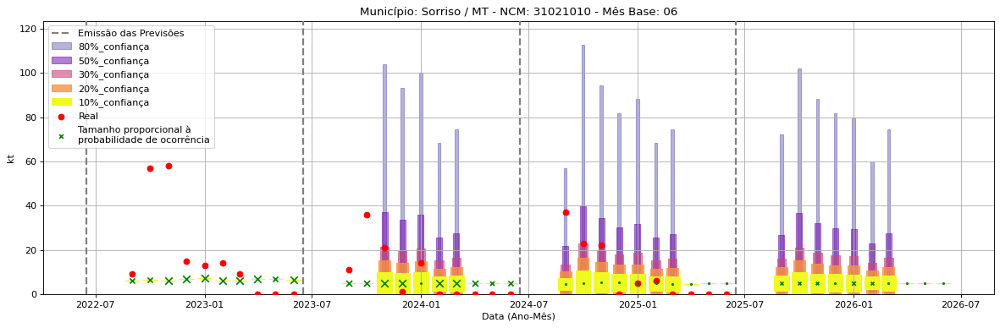
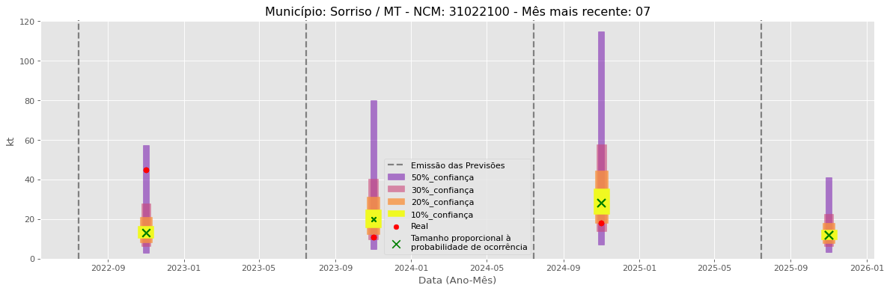
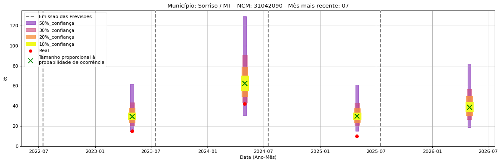

<header>
    <h1><a href="https://quantimportbrazil.github.io/Sobre/">QuantImport</a></h1>
</header>

---

# Previsão de Importação - Sorriso-MT

> **Emissão:** 06-2025
> Para fins de comparação, também apresentamos a seguir previsões e valores reais de períodos anteriores ao atual.
> As previsões foram geradas com base em dados limitados até o mês 6.

---

**[Home](https://quantimportbrazil.github.io/Sobre/)** | **[Selecionar Estado (UF)](https://quantimportbrazil.github.io/Unidades_Federativas/)**

Fator de Influência em Destaque nos últimos 8 anos:

Previsão Influenciada:
- Município: Sorriso
- Produto (NCM): Ureia, mesmo em solução aquosa, com teor de nitrogênio (azoto) superior a 45 %, em peso, calculado sobre o produto anidro no estado seco-31021010 
- Mês: 06

Fator Influenciador: Comércio Exterior
- Produto: Adubos (fertilizantes) (31)
- UF: GO
- Unidade: sm_diff

.

Fator de Influência em Destaque nos últimos 8 anos:

Previsão Influenciada:
- Município: Sorriso
- Produto (NCM): Sulfato de amônio-31022100 
- Mês: 09

Fator Influenciador: Comércio Exterior
- Produto: Adubos (fertilizantes) (31)
- UF: MT
- Unidade: sm

.

Fator de Influência em Destaque nos últimos 8 anos:

Previsão Influenciada:
- Município: Sorriso
- Produto (NCM): Outros cloretos de potássio-31042090 
- Mês: 05

Fator Influenciador: Comércio Exterior
- Produto: Adubos (fertilizantes) (31)
- UF: MA
- Unidade: kt_mun

.