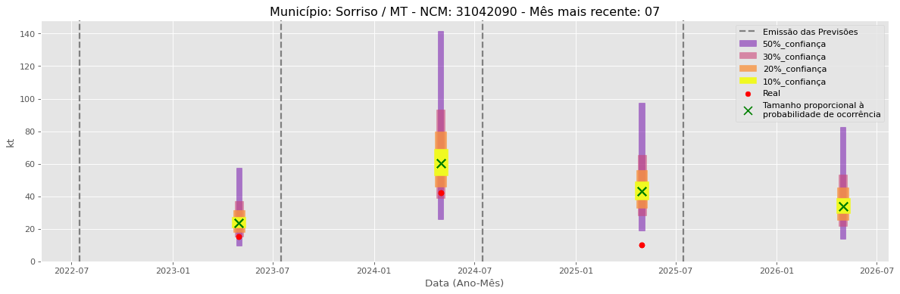

<header>
    <h1><a href="https://quantimportbrazil.github.io/Sobre/">QuantImport</a></h1>
</header>

---

# Previsão de Importação - Sorriso-MT

> **Emissão:** 06-2025
> Para fins de comparação, também apresentamos a seguir previsões e valores reais de períodos anteriores ao atual.
> As previsões foram geradas com base em dados limitados até o mês 6.

---

**[Home](https://quantimportbrazil.github.io/Sobre/)** | **[Selecionar Estado (UF)](https://quantimportbrazil.github.io/Unidades_Federativas/)**

Fator de Influência em Destaque:
Previsão Influenciada:
- Município: Sorriso
- Produto (NCM): Ureia, mesmo em solução aquosa, com teor de nitrogênio (azoto) superior a 45 %, em peso, calculado sobre o produto anidro no estado seco-31021010 
- Mês previsto: 06

Fator Influenciador: Comex
- Município: Rio Verde
- Grupo de Produto (SH2): Adubos (fertilizantes)-31 
- Mês previsto: 06
- Unidade: sm_diff

Fator de Influência em Destaque:
Previsão Influenciada:
- Município: Sorriso
- Produto (NCM): Sulfato de amônio-31022100 
- Mês previsto: 09

Fator Influenciador: Comex
- Município: Rondonópolis
- Grupo de Produto (SH2): Adubos (fertilizantes)-31 
- Mês previsto: 09
- Unidade: sm

Fator de Influência em Destaque:
Previsão Influenciada:
- Município: Sorriso
- Produto (NCM): Outros cloretos de potássio-31042090 
- Mês previsto: 05

Fator Influenciador: Comex
- Município: São Luís
- Grupo de Produto (SH2): Adubos (fertilizantes)-31 
- Mês previsto: 05
- Unidade: kt_mun

