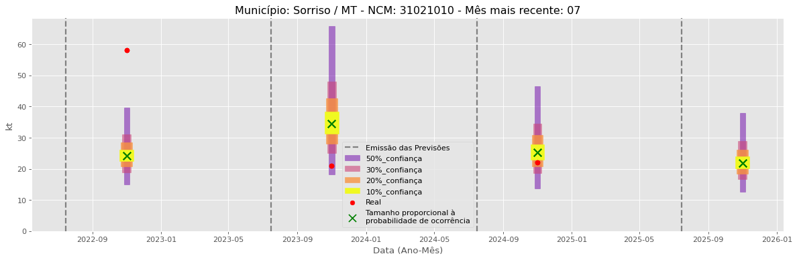

<header>
    <h1><a href="https://quantimportbrazil.github.io/Sobre/">QuantImport</a></h1>
</header>

---

# Previsão de Importação - Sorriso-MT

> **Emissão:** 06-2025
> Para fins de comparação, também apresentamos a seguir previsões e valores reais de períodos anteriores ao atual.
> As previsões foram geradas com base em dados limitados até o mês 6.

---

**[Home](https://quantimportbrazil.github.io/Sobre/)** | **[Selecionar Estado (UF)](https://quantimportbrazil.github.io/Unidades_Federativas/)**

Fator de Influência em Destaque:

Previsão Influenciada:
- Município: Sorriso
- Produto (NCM): Ureia, mesmo em solução aquosa, com teor de nitrogênio (azoto) superior a 45 %, em peso, calculado sobre o produto anidro no estado seco-31021010 
- Mês previsto: 02

Fator Influenciador:
quant_expl    Urea_lag6
mês_expl             09
importance     0.002324
Name: 43, dtype: object

Fator de Influência em Destaque:

Previsão Influenciada:
- Município: Sorriso
- Produto (NCM): Sulfato de amônio-31022100 
- Mês previsto: 09

Fator Influenciador:
quant_expl    DAP_spot
mês_expl            11
importance         0.0
Name: 15, dtype: object

Fator de Influência em Destaque:

Previsão Influenciada:
- Município: Sorriso
- Produto (NCM): Outros cloretos de potássio-31042090 
- Mês previsto: 01

Fator Influenciador:
quant_expl    MOP_spot
mês_expl            08
importance     0.04042
Name: 30, dtype: object

